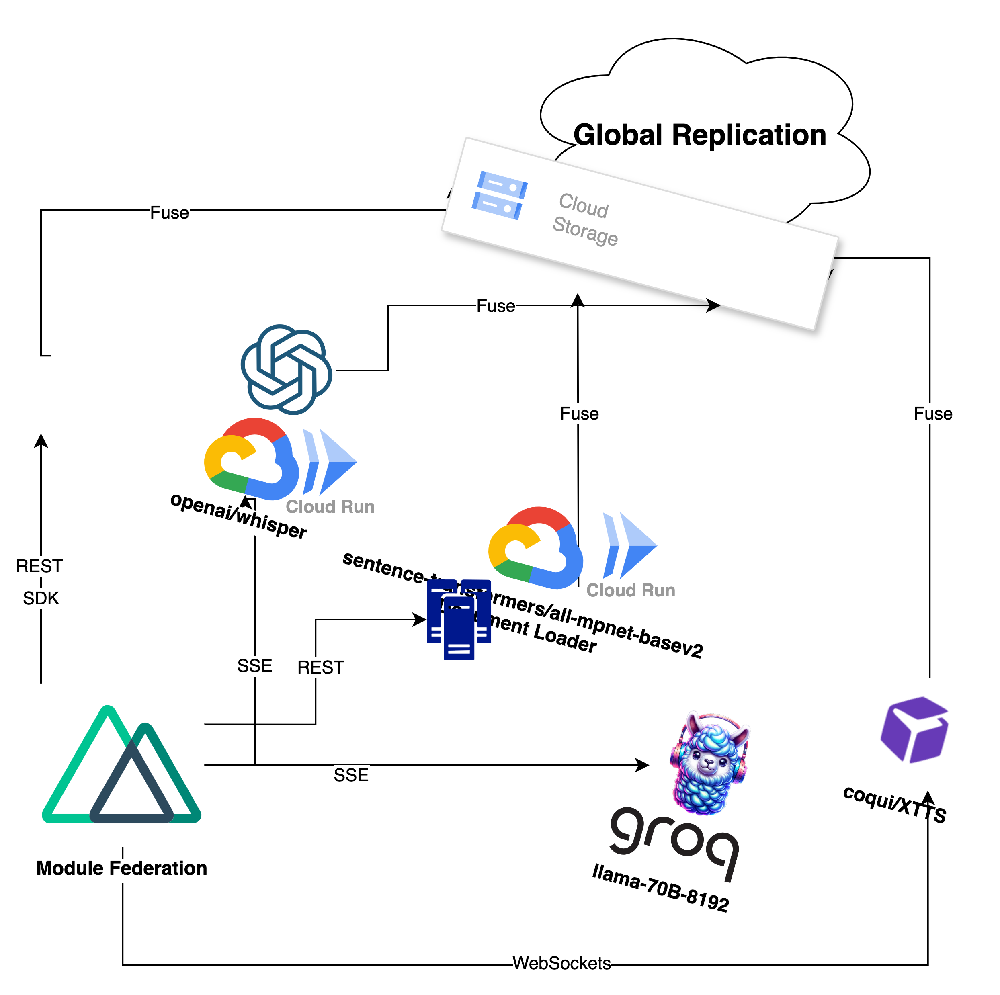

# Desarrollador VueJS: Proyecto de AI.

## Descripción

Este proyecto consiste en un conjunto de microservicios de IA Generativa que exponen sus servicios mediante 3 Protocolos:

- **HTTP**: Para comunicación stateless.
- **SSE**: Para subscripciones en tiempo real.
- **Websockets**: Para comunicación bidireccional y RPC.

## Arquitectura

Se tienen los siguientes microservicios:

- Quipubase: Base de Datos NoSQL y Vectorial.
- LLM: Large Language Model servido a través de HTTP y SSE.
- Transcribe: Servicio de transcripción de voz a texto que se integra con youtube.
- Voice: Servicio de Text To Speech Personalizable a la voz del usuario.
- Chatbot: Servicio de Chatbot que se comunica con el LLM y Voice.
- Actions: Servicios de orquestación de funciones a través del Chatbot y Voice basado en `json_schema`.

## Primera Iteración

Para la primera iteración se tiene disponible un repositorio con el proyecto de Vue.js que actualmente está conectado con el ChatBot y la Base de Datos, se busca poder integrarlo con el resto de microservicios y construir una interfaz de usuario distribuida y conectada mediante module federation compartiendo el State de Pinia para mantener la sesión del usuario.
Se requiere tener un codigo mantenible, componentes reusables y logica encapsulada en composables para poder escalar el proyecto a las siguientes fases, cabe la posibilidad de convertirse en una sociedad de desarrollo de software.

# Como postular?

Enviar una Pull Request a este repositorio con su propuesta en la carpeta frontend, explicada y detallada en un archivo markdown con el nombre de su usuario de github.

# Requisitos

- Vue 3
- Typescript
- Composition API
- TailwindCSS
- Data Fetching Patterns

# Salario

- 1200-2000 PEN por iteración basado en el valor entregado. Negociable.
